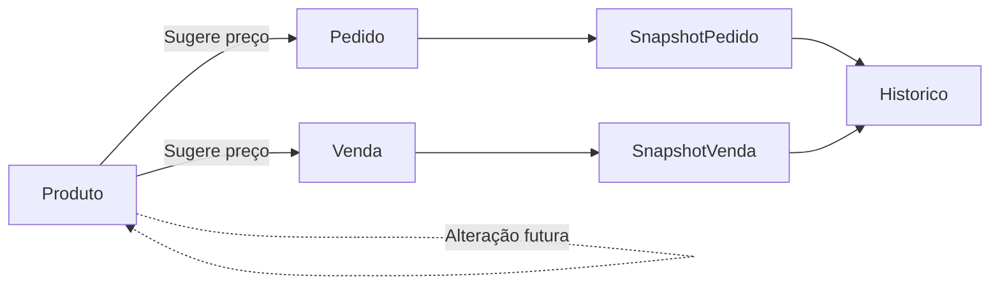

# ADR-010 — Estratégia de Snapshot Histórico de Preços

- **Status:** Aceito
- **Data:** 2026-08-01

## Contexto

Os preços dos produtos variam a cada ciclo das marcas (Avon, Natura e outras). Alterar o cadastro do produto não pode modificar informações históricas de pedidos e vendas já realizadas.

## Objetivo

Garantir que relatórios, margens e consultas históricas permaneçam fiéis aos valores praticados no momento da operação.

## Drivers Arquiteturais

- Preservação do histórico.
- Integridade dos relatórios.
- Simplicidade do modelo.
- Independência entre cadastro e operações.

## Decisão

O cadastro de **Produto** armazenará apenas os valores atuais utilizados como sugestão.

Os documentos operacionais (**ItemPedido** e **ItemVenda**) armazenarão um **snapshot** dos valores vigentes no momento da transação.

## Modelo

### Produto

Armazena:

- preço sugerido;
- demais informações cadastrais.

### ItemPedido

Armazena:

- valor de catálogo;
- valor original;
- valor pago.

### ItemVenda

Armazena:

- valor unitário vendido;
- quantidade;
- subtotal.

## Fluxo

## Regras

- Alterações no cadastro do produto não atualizam pedidos antigos.
- Alterações no cadastro do produto não atualizam vendas antigas.
- Relatórios utilizarão sempre os snapshots.
- O cadastro serve apenas como sugestão para novas operações.

## Benefícios

- Histórico consistente.
- Margem calculada corretamente.
- Auditoria simplificada.
- Independência entre cadastro e operações.

## Trade-offs

- Pequena duplicação de dados.
- Necessidade de atualização dos preços apenas para novas operações.

## Alternativas Consideradas

### Utilizar apenas o preço do cadastro

Rejeitada por comprometer o histórico quando os preços forem alterados.

### Versionamento completo de preços

Adiado por aumentar a complexidade do MVP sem benefício proporcional.

## ADRs Relacionados

- ADR-006 — PostgreSQL
- ADR-007 — Prisma ORM
- ADR-009 — Modelagem de Estoque
