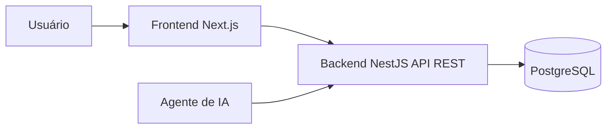
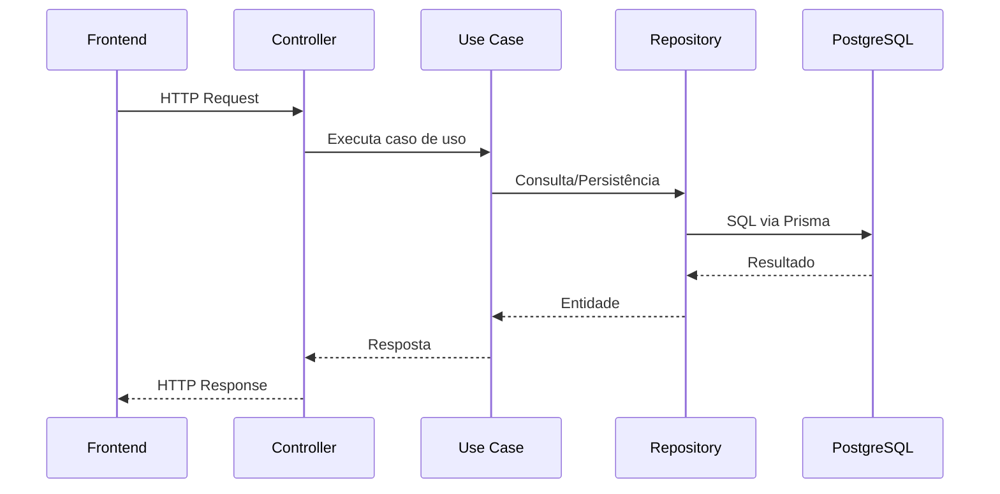

# Documento 02 — Arquitetura Geral do Sistema

## Objetivo

Descrever a arquitetura de alto nível do sistema, seus principais componentes e como eles se relacionam.

## Visão Geral

O sistema será uma aplicação web orientada a API, organizada em um monorepo e dividida em frontend e backend independentes.



## Containers

### Frontend

- Next.js
- React
- TypeScript
- shadcn/ui
- Tailwind CSS

Responsável por:

- autenticação;
- interface do usuário;
- consumo da API REST.

### Backend

- NestJS
- TypeScript
- Prisma ORM

Responsável por:

- regras de negócio;
- autenticação;
- API REST;
- auditoria;
- integração com IA.

### Banco

- PostgreSQL
- Backups automáticos
- Migrations versionadas

## Estrutura do Monorepo

```text
apps/
  frontend/
  backend/

packages/
  shared-types/
  shared-utils/

docs/
  adr/
  prd/
```

## Organização Interna do Backend

```text
modules/
  products/
  orders/
  inventory/
  sales/
  customers/
  auth/
  audit/
```

Cada módulo possui:

- domain
- application
- infrastructure
- presentation

## Fluxo de uma Requisição



## Princípios Arquiteturais

- API First
- Clean Architecture + Vertical Slice
- Monorepo
- SDD + TDD
- Controllers sem regra de negócio
- Domínio independente de frameworks
- Infraestrutura isolada

## Integrações Futuras

- Importação de XML via IA
- Scripts administrativos
- Novos canais consumidores da API
- Aplicativo móvel (sem alterar o backend)

## Referências

- ADR-001 a ADR-015
