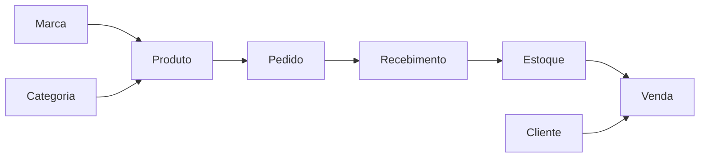

# Documento 03 — Modelo de Domínio

## Objetivo

Definir o modelo de domínio do sistema, suas entidades, responsabilidades, relacionamentos e regras de negócio. Este documento representa a visão do negócio independente de tecnologia.

## Visão Geral

O domínio é organizado em torno do fluxo operacional da revendedora:

## Agregados

### Produto

Representa o cadastro permanente de um item comercializado.

**Atributos**

- id
- marca
- código da marca
- descrição
- categoria
- preço sugerido
- ativo

**Regras**

- Código é único por marca.
- Não armazena histórico de preços.
- Não controla saldo de estoque.

---

### Pedido

Representa uma compra realizada junto ao fornecedor.

**Atributos**

- marca
- ciclo
- data do pedido
- status

**Estados**

- Em aberto
- Recebido
- Cancelado

**Regras**

- Pertence a uma única marca.
- Possui um ou mais itens.
- Só movimenta estoque quando recebido.

---

### Item do Pedido

Representa um produto comprado.

**Snapshot armazenado**

- valor catálogo
- valor original
- valor pago
- quantidade pedida
- quantidade recebida
- validade

---

### Estoque

O estoque não é um cadastro.

É uma projeção calculada a partir das movimentações.

Tipos de movimentação:

- Entrada por recebimento
- Saída por venda
- Correção
- Uso pessoal
- Devolução

---

### Venda

Representa uma operação comercial.

**Regras**

- Possui um ou mais itens.
- Pode existir sem cliente.
- Atualiza estoque imediatamente.
- Permite alteração manual do preço de venda.

---

### Item da Venda

Armazena:

- produto
- quantidade
- valor unitário vendido
- subtotal

Mantém snapshot histórico.

---

### Cliente

Cadastro opcional.

Campos:

- nome
- telefone
- CPF (opcional)
- endereço básico

---

### Usuário

Responsável pela autenticação e auditoria.

Campos:

- nome
- login
- senha
- ativo

## Invariantes do Domínio

- Produto não possui saldo.
- Estoque nunca é alterado diretamente.
- Toda movimentação possui origem.
- Pedido recebido não pode ser excluído.
- Vendas nunca alteram pedidos.
- Alterações de preço não afetam histórico.

## Casos de Uso Principais

1. Cadastrar produto
2. Criar pedido
3. Receber pedido
4. Consultar estoque
5. Registrar venda
6. Ajustar estoque
7. Consultar relatórios

## Eventos de Domínio

- PedidoCriado
- PedidoRecebido
- EstoqueAtualizado
- VendaRegistrada
- EstoqueCorrigido

## Referências

- ADR-005 — Arquitetura Híbrida
- ADR-009 — Modelagem de Estoque
- ADR-010 — Snapshot Histórico
