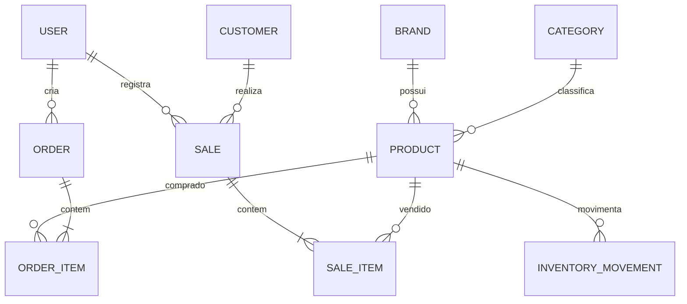

# Documento 04 — Modelo de Dados (ERD + Especificação para Prisma)

## Objetivo

Definir o modelo de dados relacional que servirá de base para o `schema.prisma` e para a implementação do PostgreSQL.

## Princípios

- UUID como chave primária.
- Datas em UTC.
- Soft delete apenas quando necessário.
- Auditoria por `created_at`, `updated_at`, `created_by`, `updated_by`.
- Histórico preservado por snapshots.

## Diagrama ER (Conceitual)

## Entidades

### User

| Campo | Tipo | Observação |
|-------|------|------------|
| id | UUID | PK |
| name | string | |
| login | string | Único |
| password_hash | string | Argon2id |
| active | boolean | |
| created_at | timestamp | |

---

### Brand

- id
- name

**Restrição:** nome único.

---

### Category

- id
- name

**Restrição:** nome único.

---

### Product

- id
- brand_id
- category_id
- code
- description
- suggested_price
- active

**Constraint**

`UNIQUE(brand_id, code)`

---

### Order

- id
- brand_id
- cycle
- order_date
- received_date
- status
- created_by

---

### OrderItem

- id
- order_id
- product_id
- quantity_ordered
- quantity_received
- catalog_price
- original_price
- purchase_price
- expiration_date

Snapshot histórico.

---

### InventoryMovement

- id
- product_id
- type
- quantity
- reference_type
- reference_id
- reason
- created_by
- created_at

Tipos:

- PURCHASE
- SALE
- CORRECTION
- PERSONAL_USE
- RETURN

---

### Customer

- id
- name
- phone
- cpf (opcional)
- address (opcional)

---

### Sale

- id
- customer_id (opcional)
- sale_date
- payment_method (opcional)
- total
- created_by

---

### SaleItem

- id
- sale_id
- product_id
- quantity
- unit_price
- subtotal

Snapshot histórico.

## Índices

- Product(brand_id, code)
- Order(status)
- Order(cycle)
- InventoryMovement(product_id)
- Sale(sale_date)
- Customer(name)

## Integridade

- Não excluir pedidos recebidos.
- Não excluir vendas.
- Movimentações de estoque são imutáveis.
- Snapshots nunca são recalculados.

## Próximo Documento

Documento 05 — Especificação da API REST.
